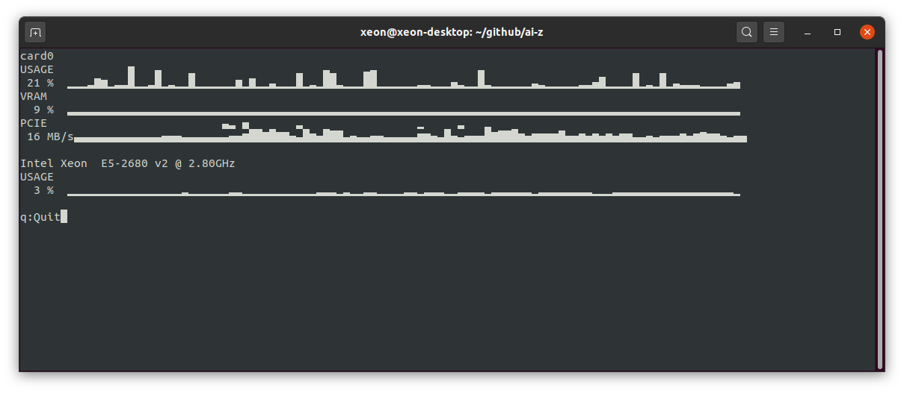

AI-Z is a tool to display hardware resource usage and info on linux. Supports both NVIDIA and AMD GPUs.




### Install and usage
```
git clone https://github.com/ai-z/ai-z.git
cd ai-z
pip3 install -r requirements.txt
python3 -m aiz.aiz
```
Alternatively using pip:
```
pip3 install ai-z
ai-z
```

### Issues
Please post issues and feature requests at: [Github issues page](https://github.com/ai-z/ai-z/issues) <br><br>
Known issues:
*   AMD GPUs name will be displayed as 'cardX'
*   PCIE bandwith usage graph on NVDIA cards is not correct


### Planned features
*   Support for Intel GPUs
*   Support for MacOS and Windows
*   Add some AI benchmarks using Pytorch and TF Lite
*   Add bandwidth and gflops tests
*   Control over sampling frequency
*   Support install throught linux app manager
*   GUI version


<!-- This loops through the paginated posts -->

  <h1><a href="{{ post.url }}">{{ post.title }}</a></h1>
  <p class="author">
    <span class="date">{{ post.date }}</span>
  </p>
  <div class="content">
    {{ post.excerpt }}
  </div>
