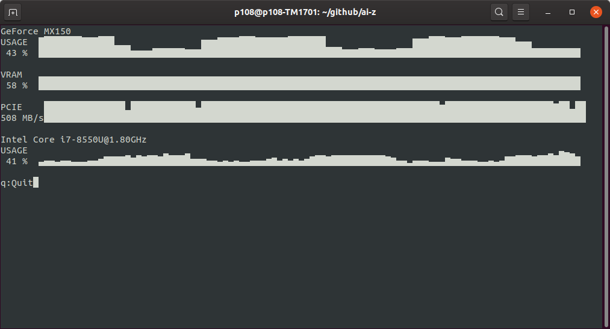

AI-Z is tool for AI devs to display hardware resource usage and info. Supports both NVIDIA and AMD GPUs




### Install and usage
```
git clone https://github.com/ai-z/ai-z.git
cd ai-z
pip3 install -r requirements.txt
python3 ai-z.py
```
### Issues
Please post issues at: [Github issues page](https://github.com/ai-z/ai-z/issues)
Known issues:
    *   AMD GPUs name will be displayed as 'cardX'
    *   PCIE bandwith usage graph on NVDIA cards is not correct

